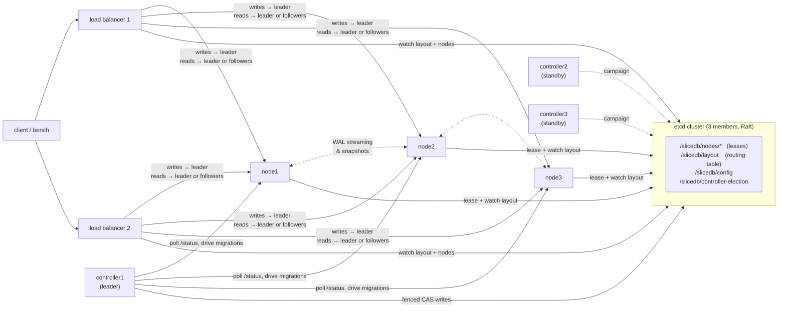

# SliceDB

[](go.mod)
[](https://etcd.io)
[](LICENSE)

SliceDB is a distributed, in-memory key-value store written in Go. Keys are hash-partitioned across a cluster of nodes, and each partition is replicated from a leader to its followers through a write-ahead log. The cluster fails over on its own, rebalances when nodes join or leave, and can change its partition count while it keeps serving traffic.

All coordination goes through etcd: membership, service discovery, controller leader election and the routing table. There is no single point of failure. You can kill any node, any controller (including the leader), any load balancer or one etcd member, and reads and writes keep working.

```
$ client bench -duration 16s -concurrency 16 -reads 0.5          # node1 is kill -9'd at t=3s
[    3s] rps=28757   ok=28757  err=0    p50=473µs    p95=1.1ms    p99=1.7ms
[    4s] rps=299     ok=299    err=0    ...                        ← lease expires, failover
[    9s] rps=33703   ok=33703  err=0    p50=408µs    p95=920µs    p99=1.5ms
---
total: 369795 ok, 0 errors, 16 client retries in 16.004s
```

## Features

- Hash partitioning with `fnv32a(key) % partitions` and a configurable replication factor.
- Leader/follower replication. Every write goes to the partition leader's write-ahead log, and followers stream that log over HTTP long-polling. Replication is asynchronous and eventually consistent.
- In-memory LSM storage: a mutable memtable plus immutable levels. Snapshots don't stop writes, and old levels are compacted in the background.
- Snapshot and WAL catch-up. A new or lagging replica loads a point-in-time snapshot, then replays the WAL from the snapshot's checkpoint.
- Automatic failover. When a node's etcd lease expires, its most up-to-date follower becomes leader. A node that comes back discards its data and resyncs.
- Graceful leadership handoff. Writes pause briefly while the target catches up to the exact sequence number, then leadership moves, so no acknowledged write is lost.
- Online resharding. You can change the partition count (for example from 8 to 12, or from 12 to 6) under load. Keys move one target partition at a time while both hash formulas are routed side by side.
- Auto-balancing spreads replicas and leaderships evenly as nodes join, get drained or die.
- Any number of controllers can run. They hold an etcd election, and every layout write is fenced on the leader's election key.
- Stateless load balancers route with the layout they watch in etcd, retry around failovers, and support `leader`, `round-robin` or `followers` read strategies.
- A client library and CLI with retries and backoff, a load generator that reports RPS and latency percentiles, and `fill` / `verify` commands for checking that data survived.
- A web control panel for changing the partition count and replication factor, draining nodes, moving replicas, transferring leadership and watching cluster events.
- A Docker Compose deployment with a 3-member etcd cluster, 3 controllers, 3 to 5 nodes, 2 load balancers and configurable CPU/RAM limits per container.

## Architecture



| Component | Binary | Role |
|---|---|---|
| Node | `cmd/node` | Holds partition replicas in memory, leading some partitions and following others. It registers itself in etcd under a lease and reconciles its local partitions against the layout it watches. |
| Controller | `cmd/controller` | Runs the control loop: failover, replica placement, balancing, handoffs and resharding. Every copy campaigns in an etcd election, and only the winner acts. All copies serve the panel and forward changes to the leader. |
| Load balancer | `cmd/loadbalancer` | Stateless router. Writes go to the leader and reads follow the chosen strategy. It retries when a node answers "not mine anymore" or fails. |
| Client | `cmd/client`, `pkg/client` | Go library and CLI that retries across multiple load balancers. |

## Quick start

You need Docker with Compose v2. Go 1.23+ is only needed to build or test outside Docker.

```bash
docker compose up -d --build
```

This starts 3 etcd members, 3 controllers, 3 nodes and 2 load balancers. Then:

```bash
# talk to the cluster
docker compose run --rm client set user:42 alice
docker compose run --rm client get user:42
docker compose run --rm client del user:42

# load test through both load balancers
docker compose run --rm client bench -duration 30s -concurrency 64 -reads 0.8
```

The control panel is at http://localhost:8080. Ports 8081 and 8082 serve the same panel from the other two controllers.

You can add nodes at any time, including under load. They register themselves and the balancer moves partitions onto them:

```bash
docker compose --profile extra up -d node4 node5
```

Plain HTTP works too:

```bash
curl -X POST   localhost:9000/set    -d '{"key":"k","value":"v"}'
curl           'localhost:9000/get?key=k'
curl -X DELETE localhost:9000/delete -d '{"key":"k"}'
```

## Control panel

The panel is built into the controller binary and refreshes every 2 seconds. It shows:

- the controllers, and which one currently holds the etcd election;
- each node's state, leader and replica counts, keys and operation counters;
- every partition's epoch, leader, WAL sequence number, memtable size and LSM levels, its in-sync followers with their replication lag, joining replicas, and resharding progress;
- a live log of cluster events: failovers, handoffs, rebalancing moves and migrations.

From the panel you can:

| Action | What happens |
|---|---|
| Set partition count | Starts an online resharding into a new generation. |
| Set replication factor | Replicas are added or removed. A copy is only removed once enough others are in sync. |
| Drain / undrain a node | The node's replicas and leaderships move away. Once it holds nothing, it is safe to stop. |
| Move a replica | The new copy joins first, and the old one is evicted once the new one is in sync. The partition is then pinned. |
| Make a follower the leader (⇪) | Graceful handoff. The partition is then pinned so the auto-balancer won't undo it. |

The same operations are available through the admin API (see [HTTP API](#http-api)).

## How it works

### etcd holds all cluster state

| Key | Written by | Purpose |
|---|---|---|
| `/slicedb/nodes/<id>` | each node, bound to a 5 s lease | Membership and service discovery (address and incarnation). |
| `/slicedb/controller-election/*` | controllers, via `concurrency.Election` | Picks the leader controller. The value is its HTTP address. |
| `/slicedb/controllers/<id>` | each controller, bound to a lease | Lists live controllers for the panel. |
| `/slicedb/config` | panel / API | Desired partition count and replication factor. |
| `/slicedb/drain/<id>` | panel / API | Nodes an operator wants emptied. |
| `/slicedb/layout` | the leader controller only | The routing table: partitions, leaders, followers, epochs and resharding state. |

Nodes and load balancers watch `/slicedb/layout` and `/slicedb/nodes/`, so a new routing table reaches every component within milliseconds without polling. Controllers keep no state of their own, and a newly elected controller continues from whatever is in etcd.

Layout writes are fenced. Each one is an etcd transaction with two conditions: the layout's `ModRevision` must be unchanged, and the writer's election key must still exist with its original create revision. A controller that was cut off from etcd and lost its session therefore can't overwrite its successor's decisions, even while it still believes it is the leader.

### Membership and incarnations

A node registers `{id, address, incarnation}` under a lease and keeps the lease alive. When the process dies, the lease expires, etcd deletes the key, and the controller sees the deletion through its watch and fails the node's partitions over.

The incarnation is a timestamp chosen when the process starts, and the layout records which incarnation its assignments were made for. A node that restarts within the lease TTL comes back with a new incarnation and an empty memory. The controller treats it as a failed node that rejoined: it removes the node from every partition and later adds it back as a fresh replica. The node itself ignores its assignments until the controller has acknowledged its current incarnation, so a restarted node never believes it still leads data it has lost.

On SIGTERM (for example `docker compose stop`), a node revokes its lease so failover happens immediately, and a leader controller resigns the election.

### Replication

Each partition replica is an in-memory LSM store fed through a WAL.

1. On the leader, a write is appended to the WAL, which assigns the next sequence number, and then applied to the memtable. Writes to one partition are serialized, so WAL order equals apply order.
2. A follower long-polls `GET /replicate?after=<seq>`. The leader answers as soon as new entries exist, or after 1 s if none do. In practice this works like a stream, and the leader never has to push to its followers.
3. A new or reset follower first calls `GET /snapshot`. The leader appends a checkpoint to its WAL, freezes the memtable into an immutable level and releases its lock, then copies the immutable levels while new writes go into a fresh memtable. The follower loads the snapshot and resumes streaming right after the checkpoint.

Each leadership has an epoch. After a failover, a follower may keep its data only if that data is a prefix of the new leader's history: it came from the same previous epoch, and its sequence number is no greater than the leader's at promotion. Otherwise (for example when the follower is ahead of the new leader) the leader answers `410 Gone` and the follower reloads a snapshot. A demoted leader always discards its data and resyncs.

The WAL keeps the last `--wal-retain` entries. A follower that falls further behind than that is sent back to the snapshot path.

### In-memory LSM

```
writes ──► memtable (mutable)
              │ reaches --flush-size or a snapshot is needed → checkpoint in WAL
              ▼
           level N (immutable, tagged with checkpoint seq)
           level N-1 …
           level 0      ◄── background compaction merges levels (and drops tombstones)
```

Reads check the memtable first, then the levels from newest to oldest. Levels never change after they are created and the level list is copy-on-write, so a snapshot is a list of pointers taken under a very short lock. Compaction can't invalidate a snapshot that is still being streamed. Nothing is written to disk.

### Failover, handoff and balancing

The leader controller runs a round every second, and right away on any membership or config change. Each round it polls every node's `/status` (role, epoch, WAL sequence number, sync state) and then works through these steps:

- A partition without a live leader promotes the in-sync follower with the newest data (data epoch first, then sequence number) and bumps the epoch.
- New replicas start as joining. They become in-sync followers, which may serve reads, once they have loaded a snapshot and trail the leader by fewer than 64 entries. Surplus copies are only removed while enough in-sync copies remain.
- A graceful handoff marks the partition `handoff` and the leader seals it, so writes get a 503 and the client retries. When the target has replicated up to the sealed sequence number, the epoch is bumped and the target takes over. The old leader rejoins as a fresh replica.
- Replicas move from the busiest node to the idlest one, with the new copy added before the old one is evicted. Leaderships are spread with handoffs. Partitions placed by hand are pinned and skipped.

### Online resharding

Changing the partition count from *N* to *M* creates a new generation of *M* partitions next to the current *N*, and both hash formulas stay live:

```
route(key):
    new = hash(key) % M
    if migration[new] == done:  → generation g+1, partition new
    else:                       → generation g,   partition hash(key) % N
```

The leader of each target partition pulls the matching keys from every old partition that can hold some. Those are the partitions `p` with `p ≡ new (mod gcd(N, M))`, so doubling from 4 to 8 reads from exactly one source. Each migration has three steps:

1. Bulk copy from filtered snapshots of the old leaders, which keep accepting writes meanwhile.
2. Each old leader stops accepting writes for the moving keys only, and returns the matching WAL entries written since its snapshot.
3. The controller checks that no source changed leader during the copy, then marks the partition `done`. Load balancers start routing its keys to the new generation.

Writes to a moving key range are blocked only between steps 2 and 3, a few milliseconds per partition. When every partition is done, the new generation becomes current and nodes drop the old partitions. Migrated data goes through the new leader's WAL, so its followers receive it through normal replication.

### Load balancer and client retries

The load balancer routes with its copy of the layout and tells the node which partition it picked (`?gen=&pid=`). If the node's own layout disagrees because one side is stale, the node answers `421 Misdirected Request`, and the load balancer retries with backoff once the new layout arrives. Reads fall back to another in-sync replica when one fails, so they keep working even while a partition has no leader. The client adds its own retries with exponential backoff and rotates across load balancers.

## Failure handling

| What fails | What happens | Measured locally |
|---|---|---|
| Node crash (`kill -9`) | The lease expires and the controller promotes the most up-to-date followers. Clients retry through the gap. | Writes to the affected partitions paused ~4 s (lease TTL is 5 s). 0 client errors. |
| Node stop (SIGTERM) | The lease is revoked and failover is immediate. | 0.07 s, 0 client retries |
| Node restart | New incarnation: the node rejoins empty, reloads snapshots and gets rebalanced. | 0 errors, 0 lost keys |
| Leader controller crash | Its etcd session expires, a standby wins the election and continues from etcd. | ~4 s (session TTL is 5 s), data path unaffected |
| Leader controller stop | It resigns the election and a standby takes over. | 0.12 s |
| Leader controller and a node at once | The new leader performs the failover. | 0 client errors |
| 2 of 3 nodes at once (RF = 3) | The remaining replicas become leaders. | 30,000 / 30,000 keys verified |
| One etcd member | The Raft quorum (2 of 3) keeps serving, and clients switch endpoints. | n/a |
| A load balancer | The client rotates to the next one. | n/a |

These numbers come from running the real binaries as local processes on a laptop against a single-member embedded etcd. The etcd-member and load-balancer rows are covered by `scripts/scenarios.sh 7` but were not part of that local run.

## Test scenarios

`scripts/scenarios.sh` runs the scenarios end to end against Docker Compose:

```bash
scripts/scenarios.sh 1     # single node + controller + load balancer, CRUD and RPS
scripts/scenarios.sh 2     # 3 → 5 nodes, RF 2 → 3: does RPS scale?
scripts/scenarios.sh 3     # stop a node under load, failover, verify data
scripts/scenarios.sh 4     # rolling restart of every node, verify after each
scripts/scenarios.sh 5     # add a node under load, watch rebalancing
scripts/scenarios.sh 6     # RF 2 → 3 → 1, kill 2 of 3 nodes, reshard 8 → 16 under load
scripts/scenarios.sh 7     # kill the leader controller + an etcd member + a node
scripts/scenarios.sh all
```

The scenarios write deterministic keys with `client fill` and read every one back with `client verify`. A single missing or wrong value fails the run.

The unit tests cover the LSM (snapshot isolation, compaction), the WAL (truncation, contiguity), partitions (snapshot plus log replication, the failover prefix rule, seals, freezes), resharding source selection and the controller's planner. The planner tests simulate a cluster going through bootstrap, node failure, restarts, a new node, drains, replication factor changes and pinned partitions, and check that the layout ends up balanced and fully replicated each time.

```bash
go test -race ./...
```

## HTTP API

### Load balancer (`:9000`, `:9001`)

| Method | Path | Body / query |
|---|---|---|
| `POST` | `/set` | `{"key": "...", "value": "..."}` |
| `GET` | `/get` | `?key=...` → `{"value": "..."}` or 404 |
| `DELETE` | `/delete` | `{"key": "..."}` |
| `GET` | `/metrics`, `/layout`, `/health` | counters and per-second rates, current routing table |

### Controller admin API (`:8080` to `:8082`; standbys forward to the leader)

| Method | Path | Body |
|---|---|---|
| `GET` | `/api/state` | full cluster view (used by the panel) |
| `GET` | `/api/stable` | 200 once converged, otherwise 503 with the reason (useful in scripts) |
| `POST` | `/api/config` | `{"partition_count": 16, "replication_factor": 3}` (either field optional) |
| `POST` | `/api/nodes/drain` | `{"node": "node2", "drained": true}` |
| `POST` | `/api/partitions/leader` | `{"partition": 3, "node": "node1"}` |
| `POST` | `/api/partitions/move` | `{"partition": 3, "from": "node1", "to": "node4"}` |
| `POST` | `/api/partitions/unpin` | `{"partition": 3}` |

### Node (`:7000`, internal)

`/set`, `/get`, `/delete`, `/status`, `/replicate`, `/snapshot`, `/migrate/export`, `/migrate/pull`, `/health`.

## Configuration

### Compose environment variables

| Variable | Default | Description |
|---|---|---|
| `PARTITIONS` / `REPLICATION` | `8` / `2` | Initial config, used only on first start. Change it later through the panel or API. |
| `NODE_CPUS` / `NODE_MEMORY` | `1.0` / `512M` | Per-node resource limits. `CONTROLLER_*`, `LB_*` and `CLIENT_*` work the same way. |
| `READ_STRATEGY` | `round-robin` | `leader`, `round-robin` or `followers`. |
| `BENCH_TIME` | `20s` | Benchmark length in `scripts/scenarios.sh`. |

```bash
NODE_CPUS=0.5 NODE_MEMORY=128M READ_STRATEGY=followers docker compose up -d
```

### Binary flags

| Binary | Flags |
|---|---|
| `node` | `--id`, `--addr`, `--advertise`, `--etcd`, `--lease-ttl` (5), `--flush-size` (4096), `--max-levels` (4), `--wal-retain` (100000) |
| `controller` | `--id`, `--addr`, `--advertise`, `--etcd`, `--partitions`, `--replication`, `--interval` (1s), `--auto-balance` (true), `--session-ttl` (5) |
| `loadbalancer` | `--addr`, `--etcd`, `--read-strategy`, `--attempts` (8), `--timeout` (3s) |
| `client` | `-lb URL[,URL…]`, `-retries`; `bench -duration -concurrency -keys -reads -deletes -value-size`; `fill` / `verify -n -prefix -tag` |

`--etcd` defaults to `$SLICEDB_ETCD`, and the client's `-lb` defaults to `$SLICEDB_LB`.

## Project layout

```
cmd/
  node/  controller/  loadbalancer/  client/      entrypoints
internal/
  model/          layout, partitions, routing (Route/Owns), wire types
  registry/       etcd: leases, watches, election leader, fenced layout CAS
  storage/        in-memory LSM (memtable, immutable levels, compaction, views)
  wal/            per-partition write-ahead log with checkpoints and truncation
  partition/      a replica: WAL + LSM, roles, epochs, snapshots, seals, migration freezes
  node/           node server: reconcile from layout, replication loops, migration
  controller/     election, control loop, planner (pure), admin API, panel.html
  loadbalancer/   routing, read strategies, retries, metrics
  metrics/        counters and rates
pkg/
  client/         Go client with retries
  hash/           FNV-1a partitioning, resharding source partitions
  network/        small JSON-over-HTTP client
scripts/scenarios.sh
```

## Design trade-offs and limitations

- Replication is asynchronous. A write is acknowledged once the leader has logged and applied it, so if a leader crashes, writes that hadn't reached a follower yet are lost. Graceful handoffs and resharding lose nothing because both wait for the exact sequence number.
- Reads from followers are eventually consistent. Use `READ_STRATEGY=leader` if you need to read your own writes.
- Failure detection takes as long as the lease TTL (5 s by default). A shorter TTL notices failures sooner but also fails over on brief stalls.
- Data lives only in memory. A cluster survives losing up to `RF − 1` copies of a partition, but a full restart loses everything.
- The layout is a single JSON document, which keeps every change atomic and easy to fence. That works for thousands of partitions, but the document would get too large with millions.

## Authors

- [Kasra Siavashpour](https://github.com/kasra-sia)
- [Ardalan Siavashpour](https://github.com/Ardalan-Sia)

## License

[MIT](LICENSE)
